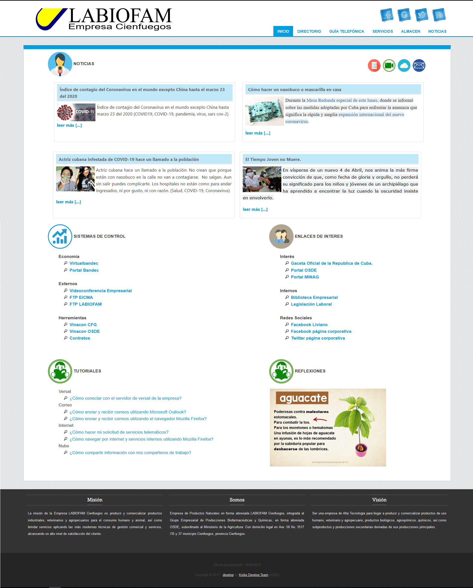

# Web Corporative Portal Simple
Simple corporate portal, includes the development of an intranet with publication of articles or news, people management, telephone directories, service management and data management on external storage through FTP services.

Description
It is a simple application, like a web portal, which one require develop support for PHP 5 and other related old technologies, light load it is needed, no frameworks or complex libraries for defining architectures or application processes should be used.

